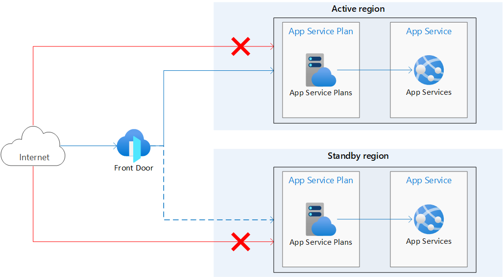

# Highly available multi-region web app in Azure demo

Based on a well-architected [publication](https://azure.github.io/AppService/2022/12/02/multi-region-web-app.html)
by Azure App Service team

## Architecture


## Highlights

Simple `HAWebApp` abstraction that
* drives deployment of two Azure Web Applications into distinct geographically dispersed regions
* hides the complexity of the associated `FrontDoor` setup
* exposes all necessary information in the Claim/Composite status

## XRD/Composition implementation features/best practices

* XRD OpenApi validation with enum
* XRD custom status
* Patching custom status with dynamic data from MR `status.atProvider`
* Bi-directional patching MR->XR status->Another MR status
* Transforms
* Dynamic matchLabel selector patching for proper resource dependency match

## Dependencies

Related Azure Family providers

```
k apply -f examples/family-providers-install.yaml
```

## E2E testing

`k apply -f package`

`k apply -f examples/hawebapp.yaml`


It will take around 8-10 minutes for FrontDoor to start the cross-regional load
balancing between the app deployments.

```
k get claim
NAME                                        SYNCED   READY   CONNECTION-SECRET   AGE
hawebapp.ha.azure.upbound.io/awesome-upbound-ha-app   True     True                        81m
```

```
k get hawebapp.ha.azure.upbound.io/awesome-upbound-ha-app -o yaml
...
  globalEndpoint: awesome-upbound-ha-app-bq7xz-jsb4q-dffdhsbhg5bwbzhs.z01.azurefd.net
  primaryAppDomain: awesome-upbound-ha-app-bq7xz-westeurope.azurewebsites.net
  secondaryAppDomain: awesome-upbound-ha-app-bq7xz-northeurope.azurewebsites.net
```

Try to access `globalEndpoint`, it should return MS service page with
```
Your web app is running and waiting for your content
```

Optionally, you can manually stop the backend application in primary
region through the Portal and see the load balancing failover in action.
